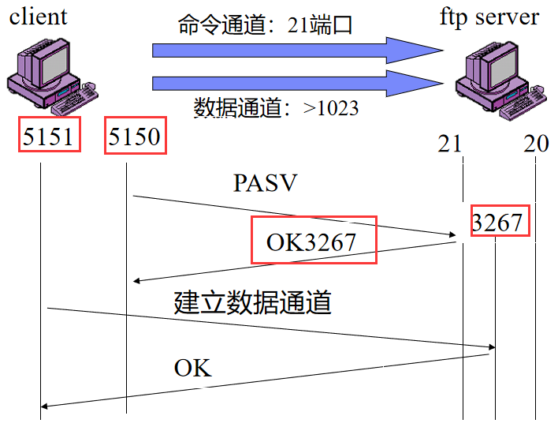
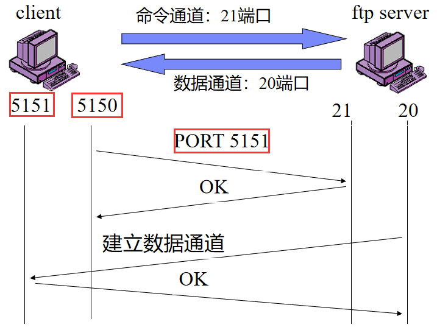
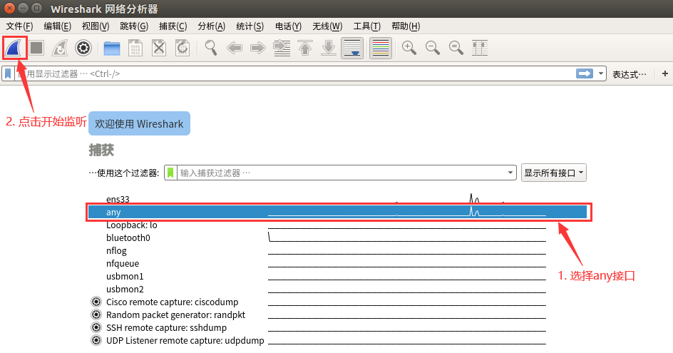

# 实验 4 - Internet 应用实例分析

[TOC]

应用层是 TCP/IP 模型的最顶层，定义了主机程序如何与传输层服务交互以使用网络。本次实验，我们将学习如何使用常见的数据包分析工具，并借此认识典型应用层协议（比如 HTTP、DNS、FTP）。


## 实验原理

### 应用层协议

Internet 以 TCP/IP 模型为基础进行构建，依托操作系统的核心协议栈，配合丰富的应用程序，为用户提供功能强大，稳定可靠的 Internet 网络服务。从 Internet 协议栈的角度看，自顶向下依次可以分为应用层，传输层，网络层，网络接口层（数据链路层与物理层）；从计算机系统的角度看，应用层运行于用户空间中，传输层、网络层、网络接口层运行于操作系统中。Internet 网络通过对不同功能进行整合分层，利用协议指定各层的交互规范，配合各层之间的接口通信，实现对外界的完整服务功能。

用户为了使用某项特定的网络服务，需要运行相应的网络应用程序，执行相应的应用层协议，在 TCP/IP 协议栈的密切配合下，与对端进行通信，从而执行相应的功能。例如，用户希望通过百度进行资源搜索，则需要打开浏览器，输入百度的网址并回车。客户端会利用 DNS 协议从 DNS 服务器获得百度的域名所对应的 IP 地址，之后根据获得的IP地址与百度的服务器依次建立 TCP 连接与 HTTP 连接，最后根据 HTTP 协议的回传数据在本地生成页面，供用户查看。

#### HTTP

超文本传输协议（HyperText Transfer Protocol，HTTP）是互联网上应用最为广泛的一种网络传输协议。HTTP 协议通过统一资源定位器（URL）来标识服务器上的资源，客户端可以向这个 URL 发送 HTTP 请求报文（Request messages），服务端根据情况返回响应报文。

请求报文中定义了方法（Methods），来指示要在标识的资源上执行的所需操作。常见的有 GET、POST、PUT、DELETE，近似可以认为分别对应获取、创建、修改、删除。

响应报文中定义了状态码（Status code），常见的 404 表示请求的资源不存在。状态码的第一个数字定义了它的类：

- `1XX` ：（信息性）已收到请求，继续处理。

- `2XX` ：（成功的）请求被成功接收、理解和接受。

- `3XX` ：（重定向）需要采取进一步行动才能完成请求。

- `4XX` ：（客户端错误）请求包含错误的语法或无法完成。

- `5XX` ：（服务器错误）服务器未能满足明显有效的请求。

响应报文中也包含内容类型（Content-Type），该字段表示响应的数据是什么类型，客户端可以根据这个字段解释数据包。例如`text/html`表示是 html 文本，而`image/png`表示 png 格式的图片。

一般来说，HTTP 底层使用的是 TCP 传输协议，但最新的 HTTP/3 要求使用 UDP + QUIC 传输协议代替 TCP/IP 连接，从而克服 TCP/IP 连接拥塞的问题。

#### HTTPS

超文本传输安全协议（HyperText Transfer Protocol over Secure Socket Layer，HTTPS）是一种通过计算机进行安全通信的应用层传输协议。HTTPS利用标准的HTTP协议进行数据通信，采用传输层安全协议 SSL/TLS（Socket Secure Layer/Transport Layer Security）来对数据包提供机密性与完整性服务，同时对客户端与服务器的合法性进行认证。

与 HTTP 相比，HTTPS 的 URL 由`https://`起始，默认传输层端口 443，而 HTTP 的 URL 由`http://`起始，默认传输层端口 80。传统的 HTTP 协议没有过多考虑数据安全，攻击者可以通过窃听以及中间人攻击等手段，获取用户的敏感信息，并发起攻击。HTTPS 可以在不安全的网络环境中构造出一条安全的数据传输通道，对应用层数据进行加密及认证，抵御监听与中间人攻击等常见网络攻击，保证浏览器与服务器之间的通信安全。

当使用 HTTPS 时，请求文件的 URL、文件内容、浏览器表单内容、cookie、HTTP 头标内容均会被加密。

当需要建立 HTTPS 连接时，客户端同时扮演 HTTP 的客户端和 TLS 的客户端，首先是 TLS 握手过程，然后是 HTTP 请求，执行标准的 HTTP 过程。当连接需要断开时，会先关闭 HTTPS，再关闭 SSL、TCP 连接。

#### DNS

域名系统（Domain Name System，DNS）是一项用于网络域名管理的互联网服务。它作为将域名和 IP 地址相互映射的一个分布式数据库，能够使人更方便地访问互联网。DNS 使用 TCP 和 UDP 端口 53。当前，对于每一级域名长度的限制是 63 个字符，域名总长度则不能超过 253 个字符，例如：`if.ustc.edu.cn`，`www.baidu.com`，`news.sina.com.cn`等。

由于普通用户对于自然语言的记忆能力远强于二进制的 IP 地址，而计算机网络必须依赖 IP 地址进行路由，因此我们需要 DNS 服务来构建域名和 IP 地址的相互映射，将普通用户输入的域名转化为计算机可以用于路由的 IP 地址。

DNS 采用层次化的名字空间，每个层次都有多个名字，每个名字对应着一个域，这些名字也被称为域名。域名由定义该层及以其上层名字的字符串组成，不同层的字符串用 . 隔开，例如`if.ustc.edu.cn`从右至左可分为 4 层。每个域都控制着如何分配直接在它下一层次的域，也称为该域的子域。DNS 名字空间被划分为一些不重叠的区域，每个区域的信息保存在该区域对应的名字服务器上，该服务器也被称为所在区域的授权名字服务器。

根名字服务保存了所有顶级域名字服务器的 IP 地址。全球共有 13 个根名字服务器，为确保可靠性和访问速度，每个服务器实际上是由多个服务器组成的集群。

名字服务器以资源记录（Resource Record）的形式来维护本区域内的域名相关信息。当解析器给名字服务器一个域名，取回的是一个与该域名相对应的资源记录。所以 DNS 系统的实际功能就是把域名映射到一条记录上。

一条资源记录共有 5 个字段：Domain_name，Time_to_live，Type，Class，Value

- Domain_name：域名名称。

- Time_to_live: 生存时间，例如，时间较长的有一天（86400 秒），短的有一分钟（60 秒）。
- Type：指出记录的类型。
- Class：对 Internet，它总是 IN。
- Value：可以是数字、域名或 ASCII 字符，其语义基于记录类型。

常见的记录类型如下：

| 类型  | 全称           | 解释                                                         |
| ----- | -------------- | ------------------------------------------------------------ |
| A     | IPv4 Address   | IPv4 地址记录                                                 |
| AAAA  | IPv6 Address   | IPv6 地址记录                                                 |
| NS    | Name Server    | 域名服务器记录，用来指定该域名由哪个 DNS 服务器来进行解析      |
| MX    | Mail Exchange  | 邮件交换记录，指向一个邮件服务器，用于电子邮件系统发邮件时根据收信人的地址后缀来定位邮件服务器 |
| CNAME | Canonical Name | 别名记录，允许将多个名字映射到同一台计算机                   |
| TXT   | Text           | 域名对应的文本信息，一般指某个主机名或域名的说明             |

#### FTP

文件传输协议（File Transfer Protocol，FTP）是一个用于在计算机网络上在客户端和服务器之间进行文件传输的应用层协议。一般运行在 20 和 21 两个端口，端口 20 用于在客户端和服务器之间传输数据流，而端口 21 用于传输控制流。

FTP 有两种使用模式：主动模式和被动模式。主动模式要求服务端主动向客户端建立数据连接。在这种情况下，客户端的防火墙可能拦截服务端的连接建立请求。因此增加了被动模式，被动模式中服务端被动接收客户端的连接建立请求，从而绕过客户端的防火墙。

|                    被动模式的通信流程                     |                    主动模式的通信流程                     |
| :-------------------------------------------------------: | :-------------------------------------------------------: |
|  |  |


### 网络分析工具

出于用户友好以及安全性的考虑，市面上的网络应用都对 Internet 的运行过程进行了良好的封装，普通人很难了解其中的细节。网络专业人士会利用一些网络分析工具，抓取 Internet 运行过程中的交互数据包，并对数据包的内容进行分析，从中提取出有效信息加以利用。

本次实验，我们需要利用常见的网络应用程序，请求特定的网络服务，利用 Wireshark 等网络分析工具获取通信过程中的交互数据包，并对报文内容进行分析，将计算机网络理论与日常网络实践相结合，在实际场景中理解 Internet 的分层、接口、协议的原理与实现，提升对于计算机网络的认识。


#### Wireshark

我们需要用到的抓包分析工具之一是 Wireshark。在 Linux 环境下启动 Wireshark 应按照如下步骤进行：在终端里使用命令`sudo wireshark`打开 Wireshark，选择`any`接口进行监听



#### tcpdump

tcpdump 是本次实验需要用到的另一个抓包分析工具。

tcpdump 可以将网络中传送的数据包完全截获下来提供分析。它支持针对网络层、协议、主机、网络或端口的过滤，并提供 and、or、not 等逻辑语句来帮助你去掉无用的信息。tcpdump 的命令格式为:

```
tcpdump [ -adeflnNOpqStvx ] [ -c 数量 ] [ -F 文件名 ] [ -i 网络接口 ] [ -r 文件名] [ -s snaplen ] [ -T 类型 ] [ -w 文件名 ] [ 表达式 ]
```

tcpdump 利用表达式作为过滤报文的条件，如果一个报文满足表达式的条件，则这个报文将会被捕获。如果没有给出任何条件，则网络上所有的信息包将会被截获。

表达式中需要注意的关键字:

1. 关于类型的关键字，主要包括 `host`、`net`、`port`。例如：
   1. `host 202.38.75.11`：指代 IP 地址是 202.38.75.11 的数据包
   2. `net 202.38.75.0/24`：指代在 202.38.75.0/24 网段的数据包
   3. `port 23`：指代端口号是 23 的数据包
2. 确定传输方向的关键字，主要包括 `src`、`dst`、` src or dst`、`src and dst`。例如：
   1. `src 202.38.75.11`：指代源地址是 202.38.75.11 的数据包
   2. `dst net 202.38.75.0/24`：指代目的地址属于 202.38.75.0/24 网段的数据包 

这些关键字可以组合起来构成强大的组合条件来满足人们的需要，例如 `tcpdump host 202.38.75.11 and port 80`。


## 实验内容

cURL 是一个命令行工具，用于使用 URL 语法来模拟网络请求，支持 HTTP/HTTPS 等多种网络协议。本次实验中，我们使用 cURL 来产生数据包。


### TCP

启动 Wireshark，开始监听数据包。在终端中执行`curl -4 http://www.example.com`指令，并从 Wireshark 中找到 TCP 连接建立时三次握手以及连接释放时的数据包，分别截图并填写下表。Seq 号和 Ack 号填相对的，Flags 填括号里的部分。注意部分系统可能只会收到 3 个释放包。

| 项目                   | 数据 |
| ---------------------- | ---- |
| 发送方 IP 地址和端口号 |      |
| 接收方 IP 地址和端口号 |      |

| 项目   | 握手包 1 | 握手包 2 | 握手包 3 | 释放包 1 | 释放包 2 | 释放包 3 | 释放包 4 |
| ------ | ------- | ------- | :------ | ------- | ------- | ------- | ------- |
| Seq 号  |         |         |         |         |         |         |         |
| Ack 号  |         |         |         |         |         |         |         |
| Flags  |         |         |         |         |         |         |         |


### HTTP/HTTPS

在终端中执行`curl -4 -v http://www.example.com`指令，该指令会显示详细的请求报文和响应报文。可以用 Web 浏览器访问网址 <http://www.example.com>，结合显示的网页理解报文的内容。注意观察 **HTTP 协议版本**、**HTTP 方法类型**、**状态码**与**内容类型**。

启动 Wireshark，开始监听数据包。在终端中分别执行下表中的指令，并从 Wireshark 中找到对应的 HTTP 数据包，分别截图并填写下表。

| 指令                                                 | 协议版本 | 方法类型 | 状态码 | 回复包内容类型 |
| ---------------------------------------------------- | -------- | -------- | ------ | -------------- |
| `curl -4 -v http://www.example.com`                  |          |          |        |                |
| `curl -4 -v -d "user=test" http://example.com/login` |          |          |        |                |

使用`curl -4 -v https://www.example.com`，观察 HTTPS 和 HTTP 有什么不同。注意不要使用`https`作为包过滤器，因为并不存在 HTTPS 数据包。


### DNS

1. 指定 8.8.8.8 为 DNS 服务器，根据下面的要求，使用`dig`查询对应的 **DNS 记录**，并填写缺失的命令和结果。

   | 查询目标                              | 命令                                  | 结果 |
   | ------------------------------------- | ------------------------------------- | ---- |
   | www.baidu.com 的 IPv4 地址            | `dig www.baidu.com @8.8.8.8`          |      |
   | 202.38.75.11 的域名                   | `dig -x 202.38.75.11 @8.8.8.8` |      |
   | jw.ustc.edu.cn 的 IPv6 地址（AAAA）   | `dig -t aaaa jw.ustc.edu.cn @8.8.8.8`        |      |
   | mail.ustc.edu.cn 的邮件交换记录（MX） |                                       |      |
   | i.ustc.edu.cn 的别名记录（CNAME） |                                       |      |
   | example.com 的域名服务器记录（NS）      |                                       |      |

2. `dig`不带域名可以用来查询**根域名服务器**，截图查询结果。

3. 使用 `dig`，发起对 `<your-student-id>.ustc.edu.cn` 的查询请求，能获得有效的 DNS 查询结果吗？记录`dig`输出内容的 status 字段，截图说明。


### FTP

使用 tcpdump 观察 FTP 的两种数据传输模式（主动模式和被动模式）的区别。

首先需要打开两个终端，一个用来登录 FTP，一个用来使用 tcpdump 捕获数据包。

进入终端 1，输入命令`ftp -4 home.ustc.edu.cn`，进入 FTP 的交互界面。提示需要登录，用户名是你的科大邮箱名（@mail 之前的那几个字母），密码是你的科大邮箱密码。

进入终端 2，输入命令`sudo tcpdump -i any -vvnX host home.ustc.edu.cn`，参数的含义可以通过`man tcpdump`查看。此时终端 1 开始抓取本机和`home.ustc.edu.cn`之间通信的数据包。注意顺序，不要在登录前打开`tcpdump`，否则抓到的包会泄露你的科大邮箱密码。

回到终端 1，登录后，默认是主动模式。输入命令`passive`，可以进入被动模式。再输入一次`passive`，会退出被动模式回到主动模式。`quit`命令可以退出 FTP。

在终端 1 里的 FTP 交互界面输入`ls`命令，显示 FTP 服务端的当前目录。分别在分别在主动模式和被动模式两种状态下执行该操作，并在终端 1 中观察两种模式的通信过程。

- 对于被动模式，寻找客户端发送的`PASV`命令和服务端的回复`Entering Passive Mode`，截图说明。根据`Entering Passive Mode`后面的参数，计算服务端开启的数据端口的端口号，并将计算的结果和后续数据包比对。
- 对于主动模式，寻找客户端发送`PORT`命令。根据`PORT`后面的参数，计算客户端开启的数据端口的端口号。截图说明。因为 NAT 的原因，FTP 服务器接收到的数据端口是客户端私网地址，因此无法在数据通道上传输数据，所以只需要计算服务端开启的数据端口的端口号，不用将计算的结果和后续数据包比对。


**可能遇到的问题：**

- Q：被动模式记录了大量的`PASV`命令，没有服务端的回复`Entering Passive Mode`。<br>
  A：重做几次，一般第二次就会恢复正常。
- Q：主动模式下输入`ls`会返回`illegal PORT command`。<br>
  A：对实验无影响，仍然可以找到`PORT`命令的数据包。


## 实验报告

实验报告应当包含实验内容中需要记录的部分，并完成以下思考题。

1. 解释 HTTP 中的幂等是什么意思？GET 操作是幂等的吗？POST 呢？
2. HTTPS 抓到的数据包与之前 HTTP 中抓到的有何不同？这是什么原因导致的？
3. FTP 实验中使用的 `sudo tcpdump -i any -vvnX host home.ustc.edu.cn` 指令整体可以达到什么效果？其中每个参数的含义分别是什么？
4. 解释从输入网址，到浏览器显示网页，在客户端的应用层依次发生了什么？
